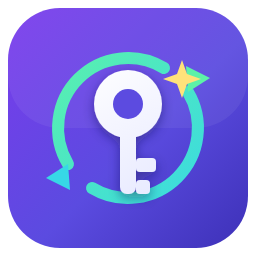

<div align="center">



# KeyRotator

**Convierte tus API keys de NVIDIA Build en un agente de IA dentro de VS Code.**
**Turn your NVIDIA Build API keys into an AI agent inside VS Code.**

Un asistente que lee y escribe archivos, ejecuta comandos, busca en la web, genera y
edita imágenes, y hasta coordina varios modelos como una agencia — todo con tu
aprobación en cada paso sensible.

**[🇪🇸 Español](#-español) · [🇬🇧 English](#-english)**

Hecho con cariño por [@Niko-Vanetti](https://github.com/Niko-Vanetti) 💛

</div>

---

<a id="-español"></a>

## 🇪🇸 Español

KeyRotator es una extensión de VS Code que convierte tus API keys de **NVIDIA Build**
(y **OpenRouter**) en un **agente con herramientas** —o en una **agencia de varios
modelos coordinados**— dentro del editor: lee y escribe archivos, ejecuta comandos,
busca en la web, genera y edita imágenes e investiga a fondo, siempre con tu aprobación
explícita en cada paso sensible.

La idea que la mueve es simple: **cada API key que pegas es un modelo**. No hay
configuración de proveedor genérico ni credenciales sueltas — pegas el bloque de código
de ejemplo de build.nvidia.com y la extensión detecta sola el endpoint, el modelo, la
key y los parámetros.

### ✨ Qué puede hacer

- **Agente con herramientas** — leer, escribir, listar y borrar archivos; ejecutar
  comandos; buscar en la web y leer páginas; cargar tus skills; recordar conversaciones
  anteriores; generar imágenes. Escribir/borrar/ejecutar siempre pide tu permiso.
- **Modo agencia** — un modelo director investiga qué modelo tuyo rinde mejor en cada
  parte, forma un equipo, trabaja en paralelo, integra el resultado y hasta puede
  relevar o proponerte contratar modelos nuevos.
- **Modo imágenes** — generar y editar imágenes con los modelos de imagen de NVIDIA
  Build; el selector solo muestra modelos capaces de hacerlo.
- **Analizador de viabilidad** — mide velocidad, consistencia y soporte de herramientas
  de cada modelo y da un veredicto (✅ recomendado / ⚠️ usable / ⛔ no viable /
  ❔ no concluyente) que queda guardado y se refresca solo.
- **Multimodal** — visión (adjuntar, pegar con Ctrl+V o arrastrar imágenes), con un
  sistema que deduce del código pegado qué sabe hacer cada modelo.
- **Skills y MCP** — importa skills desde una carpeta entera, sincroniza con tu Claude
  Code y usa tus servidores MCP (con aprobación por llamada).

### 🚀 Instalación

```bash
npm install
npm run package
code --install-extension key-rotator-*.vsix
```

Luego recarga la ventana (`Ctrl+Shift+P` → **Developer: Reload Window**).

### 🧭 Primeros pasos

1. Abre el panel **KeyRotator** en la barra de actividad (ícono de llave).
2. Usa el botón 📋 **Pegar código** de la vista Chats, o abre el **Dashboard** y su
   caja de texto.
3. Pega el bloque de código de ejemplo de build.nvidia.com (o de OpenRouter), o solo tu
   API key. Se detectan solos el proveedor, endpoint, modelo y parámetros.
4. Si el código traía una key de ejemplo, se te pide la real en un campo oculto.
5. La cuenta queda creada con el nombre del modelo y el chat se abre listo.

### 🔄 Actualizar

```bash
git pull && npm install && npm run package
code --install-extension key-rotator-*.vsix
```

Recarga la ventana. Instalar el `.vsix` sobrescribe la versión anterior sin desinstalar
ni pasar `--force`, y **no pierdes nada**: keys, configuración y chats se conservan.

### 🔒 Seguridad

Las API keys se guardan solo en el **Secret Storage de VS Code** (cifrado por el
sistema operativo). Nunca se escriben en el historial ni en archivos del repositorio.
Todo lo que produce el agente queda confinado a su carpeta de trabajo; salir de ella al
leer, escribir, borrar o ejecutar algo **requiere tu aprobación explícita**.

### 📁 Carpetas que usa

- `Documents\KeyRotator` — carpeta de trabajo (scripts, resultados, `salidas\`).
- `Documents\KeyRotator Chats` — historial de conversaciones (separado de Claude Code).
- `Documents\KeyRotator Config` — tu MCP (`mcp.json`) y skills propias.

### 🛠️ Desarrollo

```bash
npm install
npm test       # tests de la lógica core
npm run watch  # recompila en modo watch
```

`F5` en VS Code lanza una ventana de desarrollo con la extensión cargada. Todos los
ajustes viven bajo `keyRotator.*` en la configuración de VS Code.

---

<a id="-english"></a>

## 🇬🇧 English

KeyRotator is a VS Code extension that turns your **NVIDIA Build** (and **OpenRouter**)
API keys into a **tool-using agent** — or a **coordinated agency of several models** —
right inside the editor: it reads and writes files, runs commands, searches the web,
generates and edits images, and researches in depth, always with your explicit approval
on every sensitive step.

The core idea is simple: **every API key you paste is a model**. No generic provider
setup, no loose credentials — you paste the sample code block from build.nvidia.com and
the extension figures out the endpoint, model, key and parameters on its own.

### ✨ What it can do

- **Tool-using agent** — read, write, list and delete files; run commands; search the
  web and read pages; load your skills; recall past conversations; generate images.
  Writing/deleting/running always asks for your permission.
- **Agency mode** — a director model researches which of your models is best for each
  part, forms a team, works in parallel, merges the result, and can even replace a
  model or suggest hiring a new one.
- **Image mode** — generate and edit images with NVIDIA Build's image models; the
  picker only shows models that can do it.
- **Viability analyzer** — measures each model's speed, consistency and tool support and
  gives a verdict (✅ recommended / ⚠️ usable / ⛔ not viable / ❔ inconclusive) that is
  saved and refreshed automatically.
- **Multimodal** — vision (attach, paste with Ctrl+V, or drag images), with a system
  that infers from the pasted code what each model can do.
- **Skills & MCP** — import skills from a whole folder, sync with your Claude Code, and
  use your MCP servers (with per-call approval).

### 🚀 Installation

```bash
npm install
npm run package
code --install-extension key-rotator-*.vsix
```

Then reload the window (`Ctrl+Shift+P` → **Developer: Reload Window**).

### 🧭 Getting started

1. Open the **KeyRotator** panel in the activity bar (key icon).
2. Use the 📋 **Paste code** button in the Chats view, or open the **Dashboard** and its
   text box.
3. Paste the sample code block from build.nvidia.com (or OpenRouter), or just your API
   key. Provider, endpoint, model and parameters are detected automatically.
4. If the code carried a placeholder key, you're asked for the real one in a hidden
   field.
5. The account is created under the model's name and the chat opens ready to go.

### 🔄 Updating

```bash
git pull && npm install && npm run package
code --install-extension key-rotator-*.vsix
```

Reload the window. Installing the `.vsix` overwrites the previous version without
uninstalling or `--force`, and **you lose nothing**: keys, settings and chats are kept.

### 🔒 Security

API keys live only in **VS Code's Secret Storage** (OS-level encryption). They're never
written to history or repository files. Everything the agent produces stays confined to
its working folder; stepping outside it to read, write, delete or run something
**requires your explicit approval**.

### 📁 Folders it uses

- `Documents\KeyRotator` — working folder (scripts, results, `salidas\`).
- `Documents\KeyRotator Chats` — conversation history (separate from Claude Code).
- `Documents\KeyRotator Config` — your MCP (`mcp.json`) and own skills.

### 🛠️ Development

```bash
npm install
npm test       # core-logic tests
npm run watch  # rebuild in watch mode
```

Press `F5` in VS Code to launch a dev window with the extension loaded. All settings
live under `keyRotator.*` in VS Code settings.

---

## 📄 Licencia · License

KeyRotator es software libre bajo la licencia **[MIT](LICENSE)**: puedes usarlo,
modificarlo y redistribuirlo libremente, conservando el aviso de copyright. El
paquete incluye [software de terceros](THIRD-PARTY-NOTICES.md) bajo sus propias
licencias (playwright-core, Apache-2.0).

KeyRotator is free software under the **[MIT License](LICENSE)**: use, modify and
redistribute it freely, keeping the copyright notice. The package bundles
[third-party software](THIRD-PARTY-NOTICES.md) under its own licenses
(playwright-core, Apache-2.0).

<div align="center">

Ver el [CHANGELOG](CHANGELOG.md) para el historial de versiones · See the
[CHANGELOG](CHANGELOG.md) for the version history.

</div>
